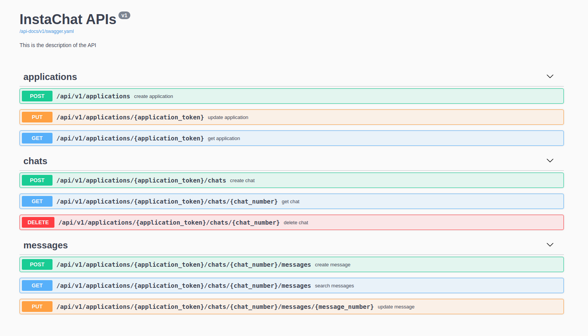

# InstaChat is a demo chat creation tool for applications with elastic search

## Make it work !

* Good news! the project is dockerized so count to 3 and this section will be done
* After forking the repo, run `docker-compose up`
* When the server is up and running use [http://localhost:3000] to check that everything looks good
* **API DOCUMENTATION** [http://localhost:3000/api-docs] if you are not familiar with Swagger Api Documentation (hopefully you are because this [Introductory video](https://www.youtube.com/watch?v=7MS1Z_1c5CU) is 10 mins long :) )

## Business Requirements

1) Main entites:
    * Application
    * Chat
    * Messages
2) Application has many chats
3) Chats belongs to application and has many messages
4) Messages belongs to chat

5) Users are referred as (applicaiton)
6) Creating apps is open for public usage without any authentication or authorization
7) Applications are identified by a token that is used for creating chats and messages
8) Creating Chats by application token
9) Each chat has a inceremtal identifier number that is used for creating its messages
10) Creating Messages by both application token and chat number
11) Anyone with application token, chat number can search for messages by keyword or index all messages in the chat
12) Real DB ids must be obscure/hidden
13) Message searching should be with *ElasticSearch*
14) **Responses** must have the identifer number even if the object will be queued for a delayed creation

## Technical Debts [*](https://www.bmc.com/blogs/technical-debt-explained-the-complete-guide-to-understanding-and-dealing-with-technical-debt/)

1) When exactly to increment the counter coloumns in both chats and applications, or just use a `before_create` callback:

    * Requirement [14] enforces having a pre-defined number sent to the consumer which will be supplied to the creation job to be used for object creation
    * This raises a need for a consistent **rollback mechanism is creation failed** to keep the counter coloum data integrant

2) Using [Optimistic vs Pessmistic](https://blog.kiprosh.com/implement-optimistic-locking-in-rails/) locks while updating the counter:

    * Even that optimisitic has better performance but it will raise error in the background that rolls back the declined changes and as we need our messages to be created, we chose pessmitic while we chose our main requirement over some performance boost, [reference](https://sipsandbits.com/2018/05/30/optimistic-locking-of-activerecord-models/)

3) Using locks or not in decrementing the counter On resource deletion
```ruby
# Not using locks as it's less likely to conflict
def decrement_chats_counter
application.decrement!(:chats_count)
end

```


## Environment

* Ruby
* Rails 
* Redis
* Resque worker
* Elasticsearch 


## TODOs:
1. Rspecs on elastic search 

## Documentation in swagger page:


## Some resources I need to return to:

* https://medium.com/@rowanoulton/testing-elasticsearch-in-rails-22a3296d989

* https://expertise.jetruby.com/ruby-go-how-to-make-them-work-together-585af6e0473

* https://github.com/railstack/go-on-rails

* https://medium.flatstack.com/one-of-our-projects-contains-elasticsearch-as-a-fulltext-search-engine-c660a28246fe
